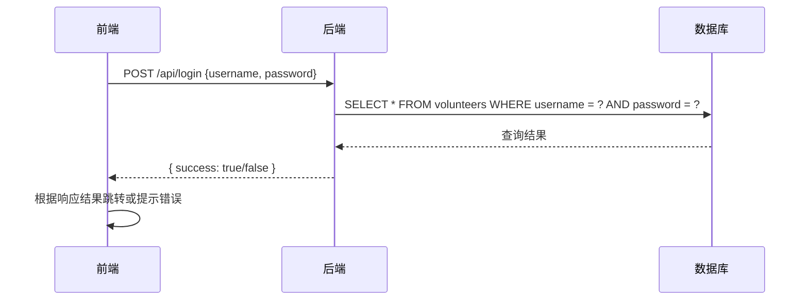

# 志愿者服务管理系统

## 项目简介
功能：项目包含志愿者服务管理系统的前端、后端、数据库，提供用户友好的界面，用于管理志愿者人员信息、
志愿服务信息。为管理员提供志愿者信息查询、服务信息查询，包含年度服务查询和总服务查询。

项目技术：
前端：Vue3 + Element-Plus
后端：Node.js + Express + MySQL
数据库：MySQL

## 构建过程
### 准备过程

1. 项目架构树
 ```bash 
   volunteer-system/
  ├─ frontend/       # 前端代码
  ├─ backend/        # 后端代码
  ├─ database/       # 数据库脚本
  ├─ package.json    # 统一管理依赖
  └─ README.md       # 项目说明
```
2. 构建项目架构
```bash
mkdir volunteer-system
cd volunteer-system 
npm init -y
mkdir frontend backend database
```

### 前端构建
```bash
cd frontend  && npm create vue@latest 
npm install element-plus axios 
npm install @element-plus/icons-vue 
npm install xlsx
```

完整引入element-plus in main.js
```bash
import 'element-plus/dist/index.css'
```

修改vite.config.js支持跨域

### 后端构建
```bash
cd /volunteer-system/
npm install express mysql2 cors body-parser
```
创建backend/app.js

### 数据库构建
   创建init.sql;

   打开HeidiSQL工具，文件 -- 运行SQL文件 -- 选择init.sql打开，会执行其中的命令，创建数据库和表，并插入admin/1234作为管理员

   mysql -u root -p 输入mysql安装时设置的密码
   source full-path-to-init.sql


### 跨域配置
  前端地址：http://localhost:5173（Vite默认开发服务器地址）

  后端地址：http://localhost:3000（Express服务器地址）

  前端请求：http://localhost:5173/api/login

  Vite代理：拦截/api开头的请求，将其转发到http://localhost:3000

  实际后端请求：http://localhost:3000/login

  浏览器始终只看到http://localhost:5173，并不知道请求被代理到后端。浏览器认为这是同源请求，不会触发跨域限制。

### 统一启动脚本
   在根目录package.json中添加统一启动脚本，并安装并行运行工具。启动项目即可。
   ```bash
   npm install concurrently
   npm run dev
```
## 运行
1. 克隆仓库：
   ```bash
   git clone <repository-url>
   ```
2. 进入项目目录：
   ```bash
   cd volunteer-system
   ```
3. 安装依赖：
   ```bash
   npm install xxx
   ```

## 使用
1. 启动开发服务器：
   ```bash
   cd volunteer-system/
   npm run dev
   ```
2. 打开浏览器访问：
   ```
   http://localhost:5173
   ```

也可以单独启动前端、后端（两个终端），每次修改backend后需要重启backend：
```bash
cd volunteer-system/
node ./backend/app.js
```

```bash
cd frontend
npm run dev
```

## 说明
### 前端、后端、数据库对接流程
1. 首先，需要确保跨域配置, 在 backend/app.js 中正确配置了CORS：
```bash
const cors = require('cors')

app.use(cors())   // 允许所有来源跨域（开发环境）

// 生产环境推荐限制来源
// app.use(cors({
//   origin: 'http://your-frontend-domain.com'
// }))
```
前端使用如下URL对接：
```bash
const response = await axios.post('http://localhost:3000/api/login', form)
```
2. 对接流程，以登录为例：


## 许可证
此项目遵循 [MIT 许可证](LICENSE)。
